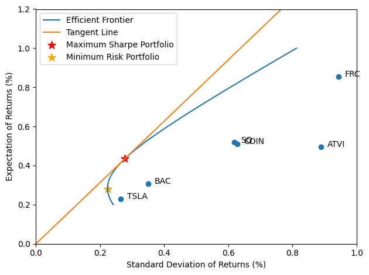

# A Comprehensive Analysis of a Multi-Stage Actively Managed Portfolio Strategy

## Abstract

The following paper presents a comprehensive analysis of a multi-stage actively managed portfolio strategy applied to major indices: NASDAQ 100, S&P 500, and NIFTY 50. The strategy employs a hierarchical filtering mechanism based on historical performance across different timeframes (12 months, 6 months, and 3 months) to select stocks. It allows for flexibility in investment allocation, employing equal distribution, maximum Sharpe ratio, or mean-variance optimization. Additionally, the strategy incorporates an alternative approach of selecting stocks based on percentile rankings within each filter. This paper aims to evaluate the efficacy and adaptability of this strategy in various market conditions.

## Introduction

### 1.1 Background

The pursuit of optimized portfolio performance has led to the development of various strategies, with a focus on blending historical performance analysis with modern portfolio theory. The strategy in question integrates these elements, aiming to capitalize on short to medium-term stock performance while considering volatility and risk-adjusted returns.

### 1.2 Objectives

- To assess the performance of the proposed multi-stage filtering strategy.
- To compare the efficacy of different investment allocation methods.
- To analyze the impact of percentile-based stock selection.

## Methodology

### 2.1 Data Selection

- Indices: NASDAQ 100, S&P 500, NIFTY 50.
- Historical performance data spanning from 2010 till 2014.

### 2.2 Filtering Mechanism

For building a portfolio every rebalancing period we experimented with different stock filters 

**Monthly Rebalancing**:-

1. 12(50),6(30),3(10) approach:-

- We will call this **Annual 3 tier filter**
- Initial Filter: Top 50 stocks based on 12-month performance.
- Secondary Filter: Top 30 stocks from the initial filter based on 6-month performance.
- Final Filter: Top 10 stocks from the secondary filter based on 3-month performance.

2. 6(50),3(30),1(10) approach:-

- We will call this **Biannual 3 tier filter**
- Initial Filter: Top 50 stocks based on 6-month performance.
- Secondary Filter: Top 30 stocks from the initial filter based on 3-month performance.
- Final Filter: Top 10 stocks from the secondary filter based on 1-month performance.

3. 12(10) approach:-

- We will call this **Yearly filter**
- One Filter: Top 10 stocks from the secondary filter based on 1-month performance.

4. 3(10) approach:-

- We will call this **Quaterly filter**
- One Filter: Top 10 stocks from the secondary filter based on 3-month performance.

5. 1(10) approach:-

- We will call this **Monthly filter**
- One Filter: Top 10 stocks from the secondary filter based on 1-month performance.

**Quaterly Rebalancing**:-

1. 12(50),6(30),3(10) approach:-

- We will call this **Annual 3 tier filter**
- Initial Filter: Top 50 stocks based on 12-month performance.
- Secondary Filter: Top 30 stocks from the initial filter based on 6-month performance.
- Final Filter: Top 10 stocks from the secondary filter based on 3-month performance.

2. 6(50),3(10) approach:-

- We will call this **Biannual 2 tier filter**
- Initial Filter: Top 50 stocks based on 6-month performance.
- Secondary Filter: Top 10 stocks from the initial filter based on 3-month performance.

3. 3(10) approach:-

- We will call this **Quaterly filter**
- One Filter: Top 10 stocks from the secondary filter based on 3-month performance.

4. 12(10) approach:-

- We will call this **Yearly filter**
- One Filter: Top 10 stocks from the secondary filter based on 1-month performance.

**Percentile Filtering**:-

- All the above filters have variation where Selection of stocks based on n percentile ranking in each filter stage.
- n :- 90, 75, 50

### 2.3 Investment Allocation Strategies

#### Equal Investment Strategy

**Concept**: The Equal Investment strategy, also known as the Equally Weighted Portfolio, involves allocating an equal percentage of capital to each asset within the portfolio. This approach assumes no prior knowledge about the future performance of assets and treats each investment with equal importance.

**Equation**:
`Investment per asset = Total Capital / Number of Assets`

**Implications**: This strategy is simple and does not require complex calculations. It inherently promotes diversification by ensuring that no single asset's performance overly influences the portfolio's overall return. However, it does not account for the risk profile of individual assets.

#### Max Sharpe Ratio Allocation

**Concept**: The Max Sharpe Ratio Allocation strategy aims to maximize the Sharpe Ratio of the portfolio. The Sharpe Ratio is a measure of risk-adjusted return, calculated as the difference between the portfolio's return and the risk-free rate, divided by the portfolio's standard deviation. This strategy seeks to construct a portfolio that offers the highest possible return for a given level of risk.

**Equation**:
`Sharpe Ratio = (R_p - R_f) / σ_p`
Where:

- `R_p` is the expected portfolio return,
- `R_f` is the risk-free rate,
- `σ_p` is the standard deviation of the portfolio's returns.

Maximizing the Sharpe Ratio involves using optimization techniques to find the proportion of each asset that results in the highest Sharpe Ratio.

**Implications**: This approach is more sophisticated than equal investment, as it considers both the returns and the volatility of the investments. It requires knowledge of expected returns, volatilities, and correlations between assets.

#### Mean-Variance Optimization (MVO)

**Concept**: Mean-Variance Optimization, introduced by Harry Markowitz in the 1950s, is a quantitative framework for portfolio selection. It aims to construct portfolios that have the best possible expected level of return for a given level of risk, or equivalently, the lowest risk for a given level of expected return. This is achieved by selecting the optimal mix of assets based on their expected returns, variances, and covariances.

**Equation**:
The optimization problem can be formulated as follows:

Minimize: 
`σ_p^2 = ∑_i=1^N∑_j=1^Nw_iw_jσ_ij`

Subject to:
`∑_i=1^Nw_i = 1,`
`∑_i=1^Nw_iR_i = R_p,`
Where:

- `w_i` and `w_j` are the weights of assets `i` and `j` in the portfolio,
- `σ_ij` is the covariance between the returns on assets `i` and `j`,
- `R_i` is the expected return of asset `i`,
- `R_p` is the desired portfolio return.

**Implications**: MVO seeks to draw the efficient frontier, a curve representing the set of portfolios that maximize return for a given level of risk or minimize risk for a given level of return. Investors can choose a point on the efficient frontier based on their risk tolerance.

### 2.4 Strategy Evaluation Metrics

- **Max Drawdown**: The maximum observed loss from a peak to a trough of a portfolio, before a new peak is attained. Max Drawdown is an indicator of downside risk over a specified time period.

- **Sharpe Ratio**: A measure of risk-adjusted return. It is calculated by subtracting the risk-free rate from the return of the portfolio and dividing by the standard deviation of the portfolio returns. A higher Sharpe ratio indicates a more attractive risk-adjusted return.

- **Sortino Ratio**: Similar to the Sharpe Ratio, but it differentiates harmful volatility from total overall volatility by using the standard deviation of negative asset returns, called downside deviation. It focuses on the volatility that harms the portfolio, providing a view of the risk-adjusted return that penalizes harmful volatility.

- **Calmar Ratio**: This ratio compares the annualized return of an investment with its maximum drawdown. The higher the Calmar Ratio, the better the investment's performance relative to its downside risk.

- **Annualized Return**: The geometric average amount of money earned by an investment each year over a given time period. It is calculated as a geometric average to show what an investor would earn over a period of time if the annual return was compounded.

- **VaR (Value at Risk)**: A measure of the risk of loss for investments. It estimates how much a set of investments might lose (with a given probability), given normal market conditions, in a set time period such as a day.

- **CVaR (Conditional Value at Risk)**: Also known as Expected Shortfall, it provides an average of the losses that exceed the VaR in the tail of the distribution of potential returns. CVaR gives a sense of the worst-case scenario beyond the VaR, offering a more comprehensive view of tail risk.

## Results and Discussion

### 3.1 Performance Analysis

- Historical back-testing results of the strategy on each index.
- Comparative analysis of different allocation methods.
- Impact of percentile-based selection versus top stock selection.

### 3.2 Risk Assessment

- Evaluation of portfolio volatility.
- Stress testing under various market conditions.

### 3.3 Strategy Adaptability

- Analysis of strategy performance in bull, bear, and sideways markets.
- Sensitivity analysis to changes in filtering parameters.

## Conclusion

### 4.1 Key Findings

- Summary of the strategy's performance across different metrics and market conditions.
- Insights into the most effective allocation method and filter parameters.

### 4.2 Limitations and Future Research

- Identification of potential limitations in the strategy.
- Recommendations for future enhancements and research directions.

## References

- Extensive bibliography of sources related to portfolio management, historical performance analysis, and quantitative trading strategies.
